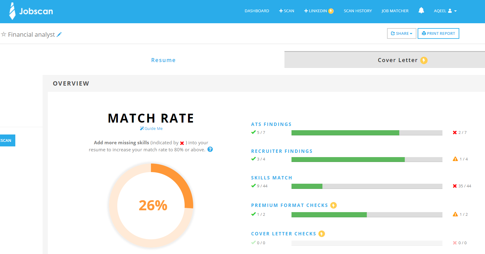
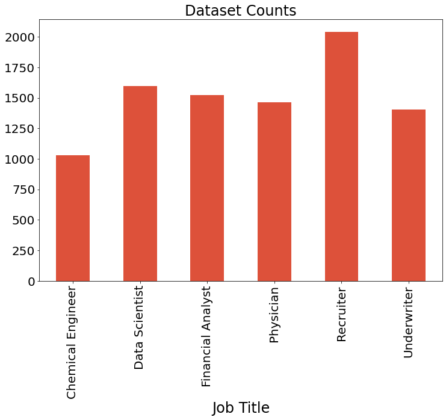
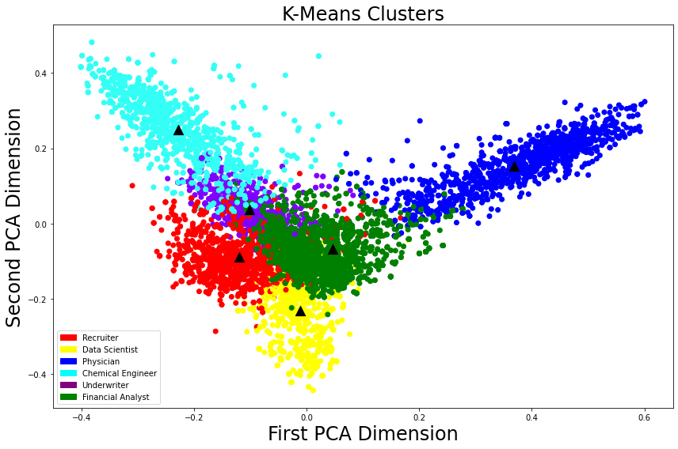
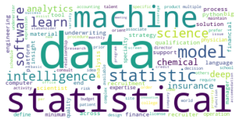
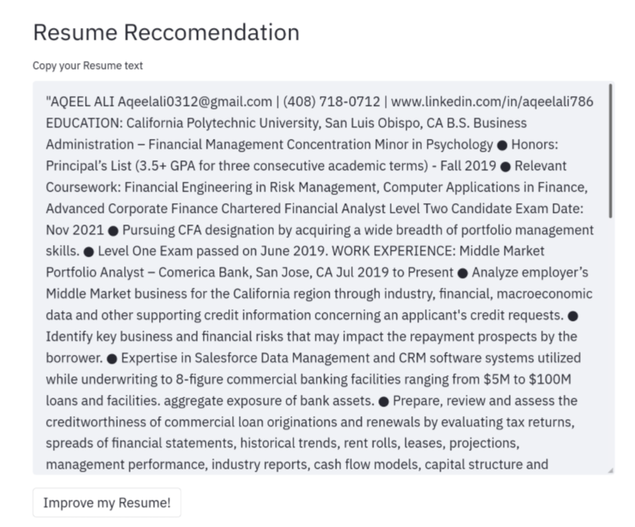
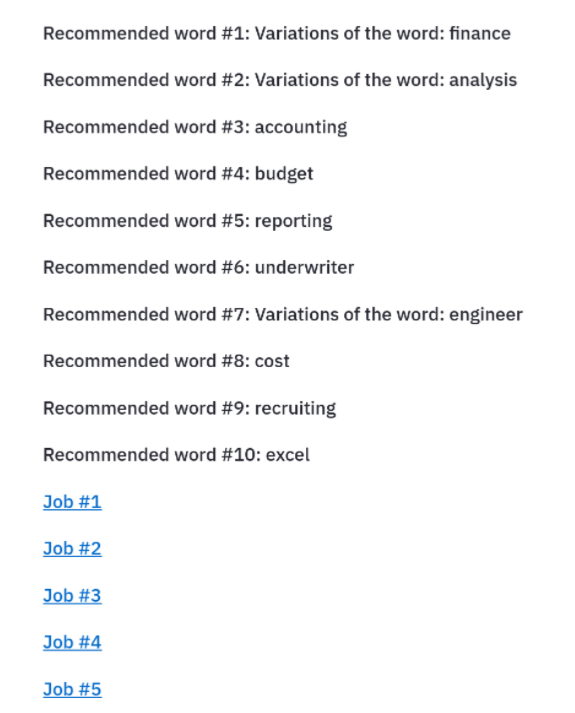

<!-- ⚠️ This README has been generated from the file(s) "blueprint.md" ⚠️--><p align="center">
  
</p>
<h1 align="center">@Resume Recommender</h1>


[](#table-of-contents)

# ➤ Table of Contents

* [➤ Project Overview](#Project-Overview)
* [➤ Project Motivations](#Project-Motivations)
* [➤ The Dataset & EDA](#The-Dataset-&-EDA)
	* [Attaining Data](##Attaining-Data)
	* [The Dataset](##The-Dataset)
	* [Data Processing](#Data-Processing)
  * [Data Visuals](#Data-Visuals)
* [➤ The Model](#-templates)
	* [Performance Comparison](#Performance-Comparison)
	* [Outputs](#logo)
* [➤ Web App Dashboard](#-contributors)
	* [License](#license)
* [➤ Closing Remarks](#-license)
	* [Future Undertakings](#Future-Undertakings)
	* [Gratitude](#license)
  * [Contributors](#contributors)
	* [Reference Material](#Reading-Material)


[](#installation)

## ➤ Project Overview

```python
print("Hello Reader!")
```

Resume Reccomender leverages a Natural Language Processing technology stack in Python to match an input string of text (denoted as a "Resume") to needed keywords to better match job descriptions, as well as provide the URL of the top 5 closest job matches based on listing contents from the database. The database consists of over 6,000 job postings from Indeed.com that are currently active (as of August 2021) and was acquired through webscraper contained within this repo's `/src/jupyter-notebooks` folder. Project prepared by Aqeel Ali for the purpose and presentation of the final capstone project for Galvanize Data Science Full-time Immersive Bootcamp Remote Pacific Cohort #7. 

[](#getting-started-quick)

## ➤ Project Motivations

As a current full-time job seeker, Aqeel (author) was experiencing troubling low yield results on applications that appeared, at first glance, to be a great fit. 

Aqeel had discovered that candidates, no matter how qualified they are, slip through the cracks of all industries' mass adoption of Applicant Track Systems. Applicant Tracking Systems have gained massive popularity across multiple domains and use cases in organizational management, talent solutions, and much more. Aqeel realized him, and oter job seekers, were up against artificial intelligence programs designed to weed out seemingly less qualified or fit applicants. Job applications companies and hiring staff are inbounded with on a daily basis, and this tool serves a great purpose for expediting the hiring process in a time and cost efficient matter for companies.

Upon discovering that the ATS filtration systems base a lot of decision making power with the contents of resumes and cover letters, Aqeel set out to develop a tool for job seekers and the like to see how their resume could be improved with the addition of suggested keywords against many currently active job listings, and what job listings they are semantically the best fit for. 

[](#getting-started-slower)

# ➤ The Dataset & EDA

## Attaining Data

The dataset consits of 9,055 rows of data across 6 labels. These labels, the job titles, serve as the classes that the model will be trained to predict. 

The 6 labels were:

```python
job_titles = 'Recruiter','Data Scientist', 'Financial Analyst', 'Physician', 'Underwriter', 'Chemical Engineer'
```

The **columns** for the dataset were: job URL, location, title, and description

The scraper grabbed the entirety of the HTML contents of each URL to a job listing on www.indeed.com
- These served as the descriptions. 

The scraper source code can be found in the `Indeed-Job_Scraper` file. 




## Job Dataset Value Counts

| Job Titles        | Quantity |
|-------------------|----------|
| Recruiter         | 2042     |
| Data Scientist    | 1597     |
| Financial Analyst | 1523     |
| Physician         | 1462     |
| Underwriter       | 1403     |
| Chemical Engineer | 1028     |



## Data Processing


The raw HTML was converted into text and then cleaned with lemmatization, stemming, removing punctuation, and lowering alphabet case.


NLP Procedures were used on the input text data to convert objects into vectors, dictionaries and symbols which can be handled very effectively using python library tools. Many operations such as searching, clustering, and keyword extraction were all done using very simple data structures, such as feature vectors.

## Cluster Analysys

Based on the shown disparity between principal and secondary components, we can already see definitive distinction between all of the job classses. This intuitively makes sense as "Physician" role is drastically different than that of a "Recruiter" role.

)


[](#templates)

# ➤ The Model

I utilized sklearn library built-in models to predict job titles given job descriptions. All of the models when hypertuned performed very strongly, with **Logistic Regression being the top choice.**

## Performance Comparison

**Baseline of 22.5% accuracy** computed by highest value count of Recruiter 2,042 / 9,055 total values.


The computer learns through numerically interpreting data; finding distances between the features, which are words in the case. However, english language and human communication isn’t numerically interpreted.

Logistic regression focuses more on probabilistic learning as opposed to linear SVC which is deterministic. Linear SVC tries to find the “best” margin (distance between the line and the support vectors) that separates the classes and thus reduces the risk of error on the data.


| RandomForestClassifier | Precision | Recall | F1-Score |
|---------------------------------------------------------------------------------------------------------------|-----------|--------|----------|
| accuracy                                                                                                      |           |        | 0.86     |
| macro average                                                                                                 | 0.84      | 0.92   | 0.87     |
| weighted average                                                                                              | 0.89      | 0.86   | 0.86     |

| LinearSVC                                          | Precision | Recall | F1-Score |
|---------------------------------------------------------------------------------------------------------------|-----------|--------|----------|
| accuracy                                                                                                      |           |        | 0.95     |
| macro average                                                                                                 | 0.95      | 0.95   | 0.95     |
| weighted average                                                                                              | 0.95      | 0.95   | 0.95     |

| MultinomialNB                                        | Precision | Recall | F1-Score |
|---------------------------------------------------------------------------------------------------------------|-----------|--------|----------|
| accuracy                                                                                                      |           |        | 0.86     |
| macro average                                                                                                 | 0.84      | 0.92   | 0.87     |
| weighted average                                                                                              | 0.89      | 0.86   | 0.86     |

| Logistic Regression | Precision | Recall | F1-Score |
|---------------------------------------------------------------------------------------------------------------|-----------|--------|----------|
| accuracy                                                                                                      |           |        | 0.97     |
| macro average                                                                                                 | 0.96      | 0.96   | 0.97     |
| weighted average                                                                                              | 0.97      | 0.96   | 0.97     |

The models were cross validated across 10 K-Folds and subsequently hypertuned.

## Outputs

**Keyword suggestions**

The model first predicts the occupation type with a resume input. Then, the model parses through all of the unique words in the resume input text and returns suggested keywords based on what words that are not in the resume input text but in the top keywords for that occupation type. 

)


[](#table-of-contents)

# Web App Dashboard 

The model was deployed using streamlit.io as a python-friendly front-end web development tool. 

The model takes an input text, directing the user to copy and paste their resume contents into the widget. 

From there, the user then is shown the suggested keywords for their clasified occupation and links to the top 5 active job postings they are semantically the best fit for on www.indeed.com


## Results Display

User pastes the text of their resume into a text-input field.

| 

The results display the top words and links to active postings on www.indeed.com that contain the most semantic similarity.

| 


[](#table-of-contents)


# Closing Remarks


## Future Undertakings

1. Having more data

- This model is limited to the backend database of the scraped ~9,000 URLs. I would like job descriptions and labels across various domains and fields to serve a wider range of users. 

2. Better resume sectionalizing 

- Each piece of data and input resumes are a single block of text. In reality, humans parse through resumes by section. Feeding in different associations to a recognized 'education' section versus a 'work experience' section is crucial.  

3. Recurrent Neural Network 

- RNNs have a more “natural” for modeling sequential textual data, especially for the tasks of modeling serialization information, and learning the long-span relations or global semantic representation.


# Contributors


|:--------------------------------------------------:|:--------------------------------------------------:|
| 
	
Aqeel Ali

